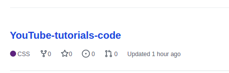
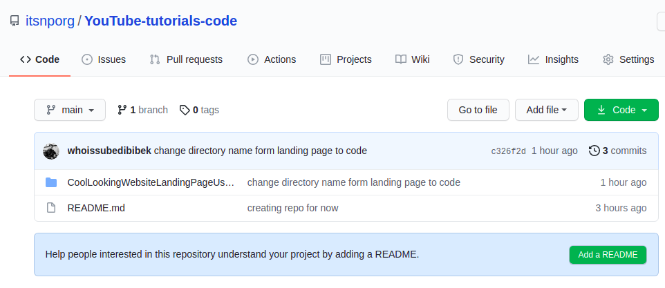
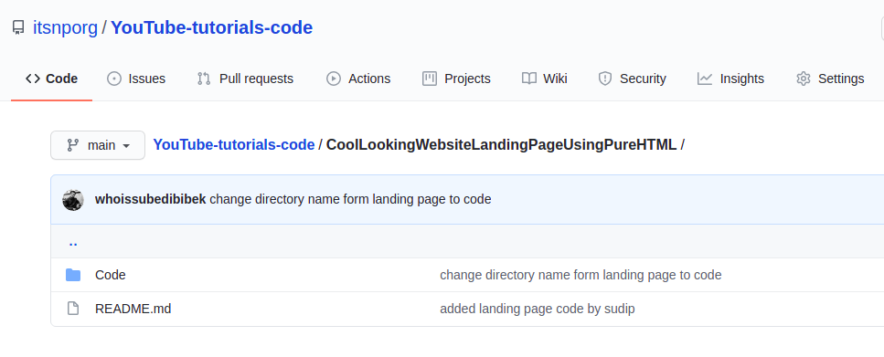
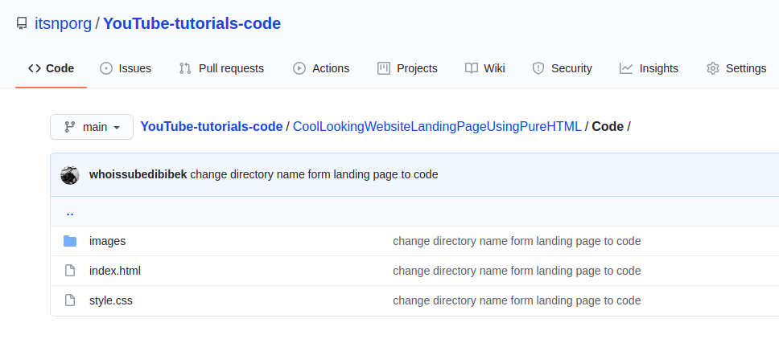

## In this Repository You'll find all the Codes Our Contributors Share! [ YOuTube ]

<br>


### How will this Repository Works
- ITSNP Contributor will upload Tutorials in ITSNP YouTube,
- Any code, templates used in the tutorials will be provided using this Repository.

<br>

<strong> If you're a Contributor<strong>
- please make a directory as your YouTube title with out space and again make a directory inside it with a name "Code"

### For Example :
If I've a Youtube video title 
<br>
<br>

```Cool Looking Website Landing Page Using Pure HTML and CSS.|| ITSNP ||``` 

<br>
<br>
Then I'll Pull this repo <br>
 <br>
I've to create a new directory inside it as 
 <br>
<br>

```CoolLookingWebsiteLandingPageUsingPureHTMLandCSS```

<br>
<br>
inside this directory <br>
I've to make a new directory as 

```Code```
<br>
<br>
inside this directory I'll add all my codes

<br>
Directory Path must be like this : <br>

`YouTube-tutorials-code/CoolLookingWebsiteLandingPageUsingPureHTML/Code/`

### after this inside 

``CoolLookingWebsiteLandingPageUsingPureHTML``
add a README file describing about 
<br>
the project you've made and ways to use them. 

<br>
Here is how it must look like:
<br>
outer repo looks like this,



<br>
Repo you've created must look like this, naming must be done like this and read me here is not a readme created by you. you'll create readme inside this repo as below.




<br>
<br>
There Must be a code directory to put all your codes and READ me file to help others to know about your project and video tutorial.
and your read me must contain video tutorial url form YouTube




<br>
code directory must be clean with only codes like this.




<br>
<strong>Thank you<strong> ❤️
